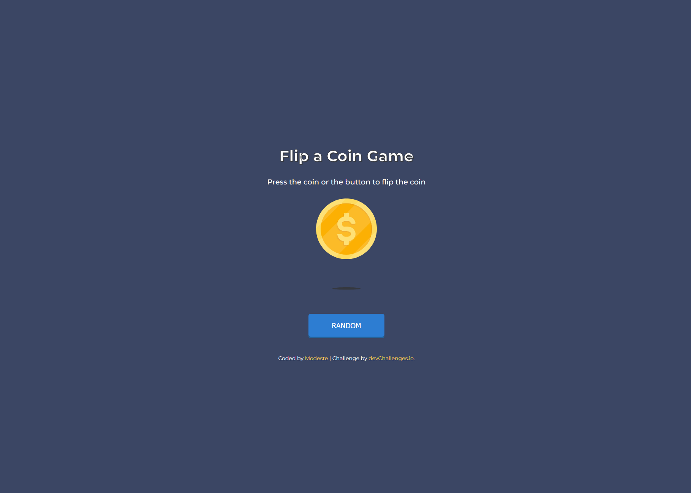

# Flip The Coin | devChallenges.io

Une simple application web qui simule un lancer de pièce (Heads ou Tails) avec un bouton pour déclencher le flip.  
Ce projet est basé sur le challenge **[Flip The Coin](https://devchallenges.io/challenge/flip-the-coin)**.

## Table des matières
- [Aperçu](#aperçu)
- [Fonctionnalités](#fonctionnalités)
- [Techniques utilisées](#techniques-utilisées)
- [User Stories](#user-stories)
- [Liens](#liens)
- [Auteur](#auteur)

---

## **Aperçu**
  

---

## **Fonctionnalités**
- Lancer une pièce virtuelle avec un bouton ou en cliquant sur la pièce.
- Animation 3D réaliste lors du flip.
- Affichage du résultat **Heads** ou **Tails** après la rotation.

---

## **Techniques utilisées**
- **HTML5** pour la structure.
- **CSS3** (flexbox + transform 3D) pour le style et l’animation.
- **JavaScript** pour la logique de lancer et l’affichage du résultat.
- **GitHub Pages** pour le déploiement.

---

## **User Stories**
- Créer une page web permettant de lancer une pièce virtuelle.
- Afficher le résultat du lancer (Heads ou Tails).
- Ajouter un bouton qui déclenche le lancer.
- Styliser la page selon un design simple.
- Utiliser **JavaScript** pour gérer la logique.
- Déployer le site afin qu'il soit accessible à tous.

---

## **Liens**
- **Solution** : [https://github.com/zm404notfound/flip-the-coin-master](https://github.com/zm404notfound/flip-the-coin-master)
- **Live Site** : [https://zm404notfound.github.io/flip-the-coin-master](https://zm404notfound.github.io/flip-the-coin-master)

---

## **Auteur**
- **LinkedIn** – [Modeste ZEVOUNOU](https://www.linkedin.com/in/zmodeste/)
- **GitHub** – [zm404notfound](https://github.com/zm404notfound)
